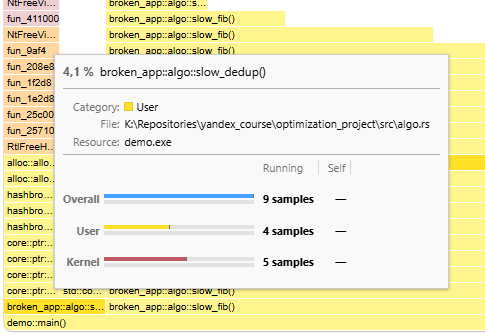
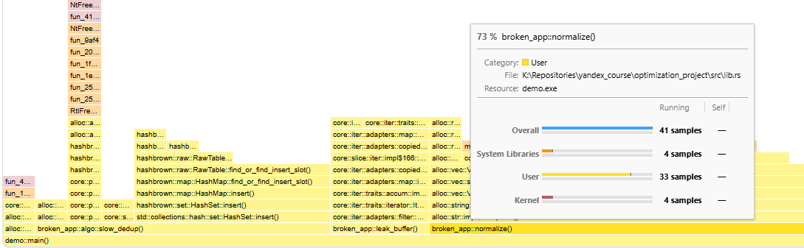
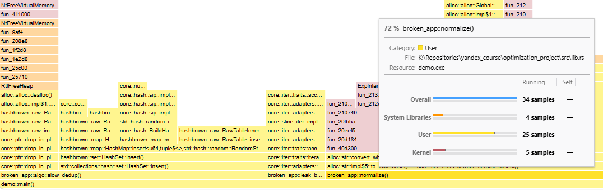

# optimization_project
Учебный проект по оптимизации и профилированию.

# Содержание
Проект содержит изначальный код с несколькими функциями, которые имеют проблемы с производительностью и утечками памяти. Он добавлен в коммите с SHA 3748603c09a6bfd893ed7f1b850e84fa5dc840af в ветку main.
Исправления расположены в отдельной ветке fix_broken_app, отведенной от main сразу после добавления изначального кода.
(В ветке main также есть 5 коммитов после добавления изначального кода, на них не нужно смотреть, т.к. они продублированы в ветке с исправлениями).

## Правка логики и неопределенного поведения
При запуске тестов через cargo test тест на функцию sum_even падает с паникой. Тест на функцию average_positive не падает, но выдаёт неверный результат.

## 1. Правка функции sum_even.

Данная функция при запуске через cargo run падает с паникой:

```plain
thread 'main' (21732) panicked at src\lib.rs:11:29:
unsafe precondition(s) violated: slice::get_unchecked requires that the index is within the slice
```

Данный стек уже намекает на то, что проблемы внутри unsafe блока, где вызывается функция get_unchecked(idx). Запуск через MIRI подтверждает это:

```plain
error: Undefined Behavior: `assume` called with `false`
  --> src\lib.rs:11:22
   |
11 |             let v = *values.get_unchecked(idx);
   |                      ^^^^^^^^^^^^^^^^^^^^^^^^^ Undefined Behavior occurred here
```

Явно утверждается, что индекс idx не удовлетворяет договоренностям не превышать размер values. После исправления через обычный итератор с подсчетом суммы запуск через cargo run выполняется уже без паники, с корректным завершением программы.
Правка выполнена в коммите с SHA a20ccc199081f78e5b7752cc9290e5e1dc332be7.

## 2. Правка функции leak_buffer.

При запуске c MIRI выводится ошибка об утечке памяти в функции leak_buffer:

```plain
error: memory leaked: alloc1203 (Rust heap, size: 4, align: 1), allocated here:
   --> C:\Users\User\.rustup\toolchains\nightly-x86_64-pc-windows-msvc\lib\rustlib\src\rust\library\alloc\src\raw_vec\mod.rs:465:41
    |
465 |             AllocInit::Uninitialized => alloc.allocate(layout),
    |                                         ^^^^^^^^^^^^^^^^^^^^^^
    |
    = note: stack backtrace:
            0: alloc::raw_vec::RawVecInner::try_allocate_in
                at C:\Users\User\.rustup\toolchains\nightly-x86_64-pc-windows-msvc\lib\rustlib\src\rust\library\alloc\src\raw_vec\mod.rs:465:41: 465:63
            1: alloc::raw_vec::RawVecInner::with_capacity_in
                at C:\Users\User\.rustup\toolchains\nightly-x86_64-pc-windows-msvc\lib\rustlib\src\rust\library\alloc\src\raw_vec\mod.rs:434:15: 434:92
            ... <другие шаги опущены для краткости>
            7: broken_app::leak_buffer
                at src\lib.rs:14:17: 14:31
            8: main
                at src\bin\demo.rs:8:36: 8:54
``` 
Запуск Valgrind даёт аналогичную картину с утечкой 4 байт в одном блоке:

```plain
==2123== HEAP SUMMARY:
==2123==     in use at exit: 548 bytes in 2 blocks
==2123==   total heap usage: 15 allocs, 13 frees, 3,714 bytes allocated
==2123==
==2123== 4 bytes in 1 blocks are definitely lost in loss record 1 of 2
==2123==    at 0x4846828: malloc (in /usr/libexec/valgrind/vgpreload_memcheck-amd64-linux.so)
==2123==    by 0x15C5A9: <alloc::raw_vec::RawVecInner>::try_allocate_in (in /mnt/c/Repositories/yandex_course/optimization_project/target/debug/demo)
... 
==2123==    by 0x12ACDB: alloc::slice::<impl [T]>::to_vec (library/alloc/src/slice.rs:376)
==2123==    by 0x12491C: broken_app::leak_buffer (lib.rs:14)
==2123==    by 0x1242E9: demo::main (demo.rs:8)
```

В данной функции извлекается сырой указатель:
```rust
let raw = Box::into_raw(boxed) as *mut u8;
```
После этой операции ответственность за освобождение памяти ложится на программиста (надо вызывать Box::from_raw), здесь же этого кода нет. После правки функции с удалением работы с сырыми указателями, отчеты MIRI и Valgrind показывают, что больше утечек нет.
Правка выполнена в коммите с SHA d0c664a0ca93f335efc66fc65c1f00bf666d2f7a.

## 3. Правка функции average_positive.

При запуске тестов они все проходят, кроме одного - averages_only_positive. Судя по его assert, он ожидает, что среднее значение положительных чисел в массиве будет равно 10, но это не так. Это происходит из-за ошибки в функции average_positive - она работает не только с положительными числами, а вообще со всеми.
Правка выполнена в коммите с SHA f0e0044b1df8680931c3f8997aaa21d019ea1d11.

## 4. Добавление теста для функции race_increment.
В файле concurrency.rs содержится функция race_increment, однако на неё нет тестов. Поэтому был добавлен тест race_increment_is_correct для покрытия её функционала.
Тест успешно проходит, однако запуск с MIRI выявляет гонку данных:

```plain
 error: Undefined Behavior: Data race detected between (1) non-atomic write on thread `unnamed-7` and (2) non-atomic read on thread `unnamed-8` at alloc79353
  --> src\concurrency.rs:15:21
   |
15 |                     COUNTER += 1;
   |                     ^^^^^^^^^^^^ (2) just happened here
   |
help: and (1) occurred earlier here
  --> src\concurrency.rs:15:21
   |
15 |                     COUNTER += 1;
    |                     ^^^^^^^^^^^^
```
Как следует из отчета MIRI, происходит гонка данных при одновременной записи и чтении глобальной переменной COUNTER из разных потоков. Это может привести к неопределенному поведению, так как операции на неатомарных переменных не гарантируют корректную синхронизацию между потоками.
Для решения этой проблемы был использован атомарный тип данных для COUNTER, чтобы обеспечить безопасный доступ к общим ресурсам:

```rust
static COUNTER: AtomicU64 = AtomicU64::new(0);
```
После правки тесты успешно проходят, а запуск с MIRI не выявляет больше гонок данных.
Правка выполнена в коммите с SHA 2c187d59860c55b9e5a3174f2f0b7c07f023b766.

## Оптимизация
## 1. Первоначальный анализ

С помощью инструмента samply (аналог flamegraph под Windows) был проведен первичный анализ работы приложения demo. В базовом варианте demo.rs пользовательские функции внутри main часто не попадали в кадр профайлинга, т.к. выполнялись слишком быстро. Было решено утяжелить их по сравнению с обычным вводом-выводом и базовыми параметрами:

```rust
fn main() {
    let nums: Vec<i64> = (0..200_000).collect();
    let bytes: Vec<u8> = (0..200_000)
        .map(|i| if i % 3 == 0 { 0 } else { (i % 251) as u8 })
        .collect();

    let text_for_normalize = " Hello   World \t Rust Profiling ".repeat(20_000);
    let dedup_data: Vec<u64> = (0..10_000).flat_map(|n| [n, n]).collect();

    let mut acc_i64 = 0_i64;
    let mut acc_usize = 0_usize;
    let mut acc_u64 = 0_u64;
    let mut acc_len = 0_usize;

    for _ in 0..30 {
        acc_i64 += sum_even(&nums);
        acc_usize += leak_buffer(&bytes);
        acc_len += normalize(&text_for_normalize).len();
        acc_u64 += algo::slow_fib(32);
        acc_len += algo::slow_dedup(&dedup_data).len();
    }

    println!(
        "ignore: {} {} {} {}",
        acc_i64, acc_usize, acc_u64, acc_len
    );
}
```
Повторный анализ показал, что самой тяжелой является функция slow_dedup (85% от main), затем идет функция slow_fib (11% от main), и третьей по значимости идет функция normalize (3.7% от main):


[Ссылка](artifacts/before_optimizations.json) на полный профайл (необходимо загрузить его на сайте https://profiler.firefox.com/).

## 2. Оптимизация функций.

Для определения эффективности оптимизаций функций был сделан замер времени выполнения каждой функции с помощью крейта criterion. Он показал следующее среднее время выполнения функций до оптимизаций:\

slow_dedup: 7.8826 мс\
slow_fib: 3.9918 мс\
normalize: 939.62 мкс

### 2.1 Оптимизация функции slow_dedup
Функция slow_dedup удаляет дубликаты из вектора. В исходной реализации она использовала алгоритм с квадратичной сложностью O(n^2), что приводило к значительным затратам времени при больших объемах данных. Для оптимизации был выбран алгоритм на основе хэш-таблицы, который позволяет удалять дубликаты за линейное время O(n). Это было реализовано с помощью структуры данных HashSet из стандартной библиотеки Rust.
После ее оптимизации она стала работать значительно быстрее, общая доля времени в функции main снизилась с 85% до 4.1%.\
\
После оптимизации функции slow_dedup, основное время кадра main стала занимать функция slow_fib (75% от main) и normalize (20% от main).
[Ссылка](artifacts/dedup_optimization.json) на полный профайл (необходимо загрузить его на сайте https://profiler.firefox.com/).

### 2.2 Оптимизация функции slow_fib
Функция slow_fib вычисляет n-е число Фибоначчи с помощью рекурсии, что приводит к экспоненциальной сложности O(2^n). Для оптимизации был выбран алгоритм динамического программирования, который позволяет вычислять n-е число Фибоначчи за линейное время O(n) и константную память O(1).
Это было реализовано с помощью итеративного подхода, который сохраняет только два последних вычисленных значения.
\
После оптимизации функции slow_fib, основное время кадра main стала занимать функция normalize (73% от main), на втором месте slow_dedup (16% от main). Функция slow_fib перестала отображаться из-за своей незначительности в общем времени main.\
[Ссылка](artifacts/fib_optimization.json) на полный профайл (необходимо загрузить его на сайте https://profiler.firefox.com/).

### 2.3 Оптимизация функции normalize
Функция normalize удаляет лишние пробелы из строки и приводит ее к нижнему регистру. В исходной реализации она использовала итерацию по символам строки и создание новой строки, что приводило к значительным затратам времени при больших объемах данных.
Для оптимизации был выбран алгоритм на основе итератора, который позволяет обрабатывать строку за линейное время O(n) и минимизировать количество выделений памяти.
Однако после оптимизации суммарная доля функции normalize практически не изменилась (72% от main).\
\
[Ссылка](artifacts/normalize_optimization.json) на полный профайл (необходимо загрузить его на сайте https://profiler.firefox.com/).

После оптимизации функций среднее время выполнения стало следующим:\
slow_dedup: 106.69 мкс (ускорение на 98%)\
slow_fib: 16.1 нс (ускорение на три порядка) \
normalize: 800 мкс (ускорение на 19%)

Результаты замера до оптимизаций и после оптимизаций доступны по [ссылке](artifacts/optimization_measurements/report/index.html).
```