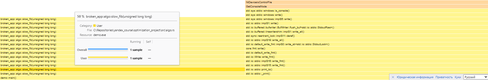

## 1. Первоначальный анализ

С помощью инструмента samply (аналог flamegraph под Windows) был проведен первичный анализ работы приложения demo. В базовом варианте demo.rs пользовательские функции внутри main часто не попадали в кадр профайлинга, т.к. выполнялись слишком быстро. Было решено утяжелить их по сравнению с обычным вводом-выводом и базовыми параметрами:

```rust
fn main() {
    let nums: Vec<i64> = (0..200_000).collect();
    let bytes: Vec<u8> = (0..200_000)
        .map(|i| if i % 3 == 0 { 0 } else { (i % 251) as u8 })
        .collect();

    let text_for_normalize = " Hello   World \t Rust Profiling ".repeat(20_000);
    let dedup_data: Vec<u64> = (0..10_000).flat_map(|n| [n, n]).collect();

    let mut acc_i64 = 0_i64;
    let mut acc_usize = 0_usize;
    let mut acc_u64 = 0_u64;
    let mut acc_len = 0_usize;

    for _ in 0..30 {
        acc_i64 += sum_even(&nums);
        acc_usize += leak_buffer(&bytes);
        acc_len += normalize(&text_for_normalize).len();
        acc_u64 += algo::slow_fib(32);
        acc_len += algo::slow_dedup(&dedup_data).len();
    }

    println!(
        "ignore: {} {} {} {}",
        acc_i64, acc_usize, acc_u64, acc_len
    );
}
```
Повторный анализ показал, что самой тяжелой является функция slow_dedup (85% от main), затем идет функция slow_fib (11% от main), и третьей по значимости идет функция normalize (3.7% от main):



[Ссылка](before_optimizations.json) на полный профайл (необходимо загрузить его на сайте https://profiler.firefox.com/).

## 2. Оптимизация функций.
Для определения эффективности оптимизаций функций был сделан замер времени выполнения каждой функции с помощью крейта criterion. Он показал следующее среднее время выполнения функций:

slow_dedup: 7.8826 мс\
slow_fib: 3.9918 мс\
normalize: 939.62 мкс

После оптимизации функций среднее время выполнения стало следующим:\
slow_dedup: 106.69 мкс (ускорение на 98%)\
slow_fib: 16.1 нс (ускорение на три порядка) \
normalize: 800 мкс (ускорение на 19%)

Результаты замера до оптимизаций и после оптимизаций доступны по [ссылке](optimization_measurements/report/index.html).
```